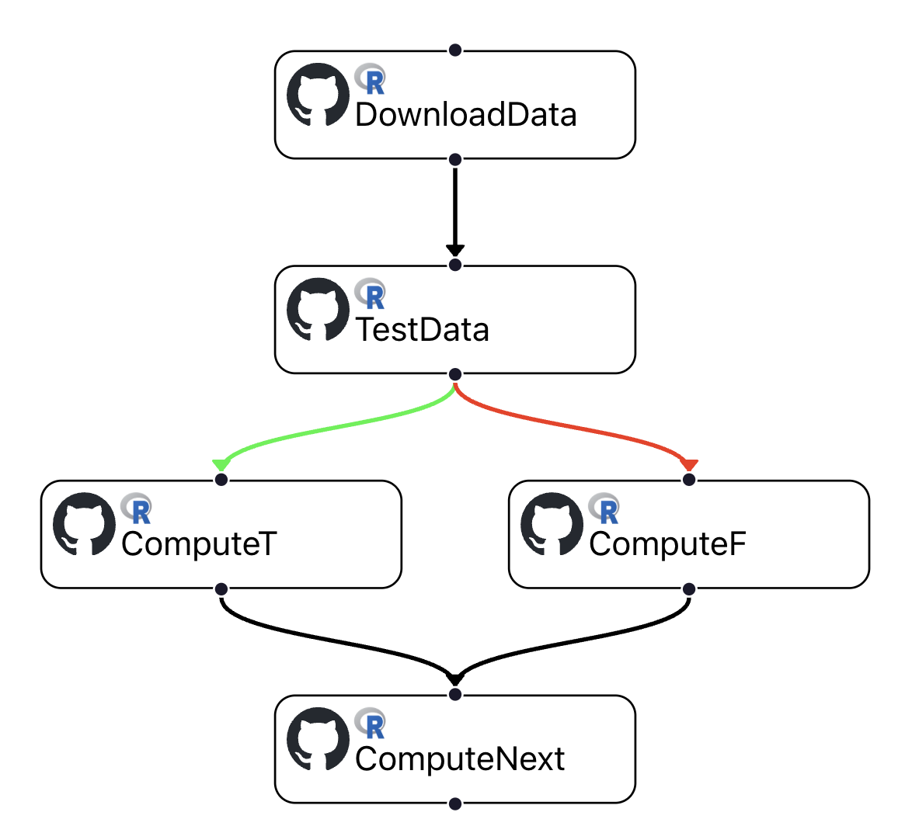
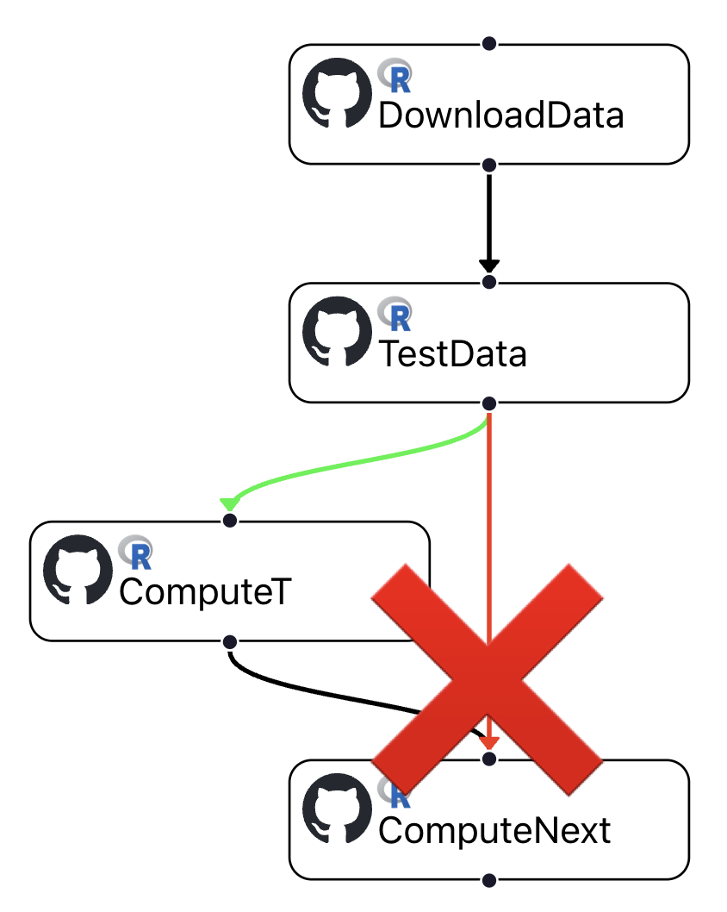

# Conditional Invocation

FaaSr supports the conditional invocation of actions in the workflow. This is useful in workflows where actions may or may not execute depending on the _return value_ (true or false) of a predecessor.

## Expressing conditional invocation in the workflow 

Consider the example below, where the action `DownloadData` always invokes `TestData` unconditionally (black edges denote unconditional execution). Now suppose `TestData` invokes a user function (in R or Python) `my_test()` that returns either `True` or `False`. 

Then, _depending on the return value of_ `my_test()`, either `ComputeT` is invoked (return value `True`, green edge), or `ComputeF` is invoked (return value `False`, red edge) - but not both.

Finally, the last action in the graph `ComputeNext` is invoked unconditionally. In effect, this implements the behavior of an if-then-else conditional execution in the workflow.

## Constraints

There are constraints that need to be observed when expressing conditional execution:

- Cycles are not allowed (the workflow graph must still be a [DAG])
- A node in a graph *cannot* have incident edges of different types (conditional and unconditional). 

The example below shows an _invalid_ use of conditionals where `ComputeNext` has incident edges of different types:

[DAG]: prog_model.md