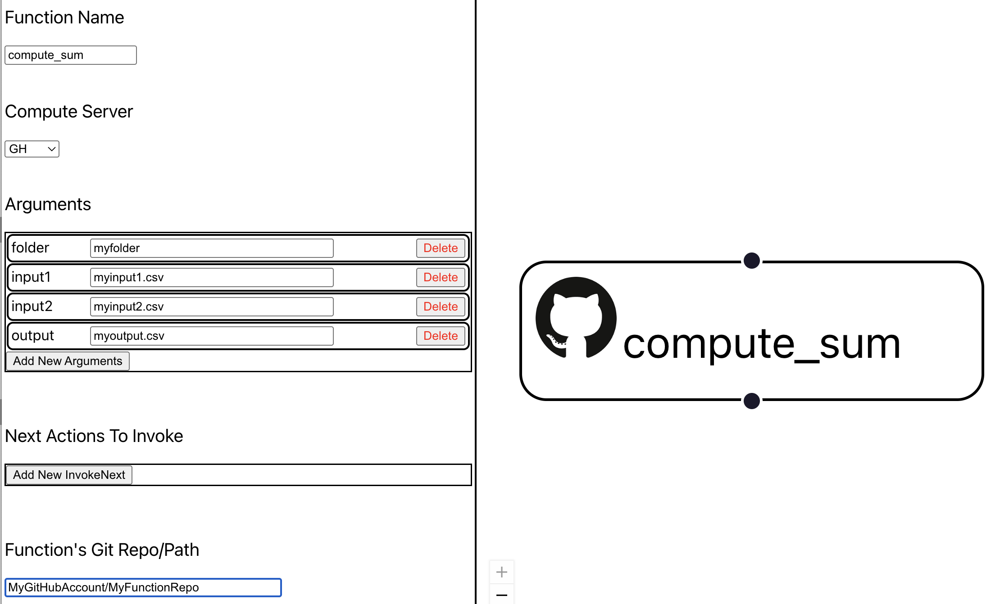

# Creating functions

## Overview

Creating a function for use in FaaSr entails the following steps:

- Select a GitHub repository to store your function code; we'll use **MyGitHubAccount** and **MyFunctionRepo** as a GitHub account name and repository name, respectively, in examples
- Develop the code for your function. A best practice is to have one file per function; we will use `compute_sum.R` and `compute_sum.py` as examples
- Add FaaSr API calls where appropriate, e.g. `faasr_get_file()` to get an input file from an S3 data server, `faasr_put_file()` to put an output file to an S3 data server, `faasr_log()` to write a message to the log. Refer to the [FaaSr R APIs] and [FaaSr Python APIs] documents for a complete list
- Add the function to a workflow. This is done using the [FaaSr Workflow Builder Web UI] by clicking on an _Action_ in the workflow DAG

## Example

Let's say you develop a function `compute_sum.R` (e.g. the one used in the [FaaSr tutorial]) as follows:

```r
compute_sum <- function(folder, input1, input2, output) {

  # FaaSr API calls to get inputs from S3 (two CSV files)
  faasr_get_file(remote_folder=folder, remote_file=input1, local_file="input1.csv")
  faasr_get_file(remote_folder=folder, remote_file=input2, local_file="input2.csv")

  # Function's main implementation (compute a sum and write the output)
  frame_input1 <- read.table("input1.csv", sep=",", header=T)
  frame_input2 <- read.table("input2.csv", sep=",", header=T)
  frame_output <- frame_input1 + frame_input2
  write.table(frame_output, file="output.csv", sep=",", row.names=F, col.names=T)

  # FaaSr API call to put the output file in the S3 bucket
  faasr_put_file(local_file="output.csv", remote_folder=folder, remote_file=output)

  # Log a message
  log_msg <- paste0('Function compute_sum finished; output written to ', folder, '/', output, ' in default S3 bucket')
  faasr_log(log_msg)
}	
```

Say you commit `compute_sum.R` to repository `MyGitHubAccount/MyFunctionRepo`. 

To use this function in a workflow, in the [FaaSr Workflow Builder Web UI] proceed as follows:



- Create an _Action_ (e.g. *compute_sum*)
- Select it to edit using the left pane
- Under _Function Name_, enter `compute_sum`; this is the name of the function declared in the code above
- Under _Compute Server_, select your compute server from the drop-down menu (e.g. GH for GitHub Actions)
- Under _Arguments_, enter names and values of the arguments matching those used by the function: `folder`, `input1`, `input2`, `output`
- Under _Function's Git Repo/Path_, enter `MyGitHubAccount/MyFunctionRepo`

## Important notes

- If you provide a GitHub repo (e.g. `MyGitHubAccount/MyFunctionRepo`) _Function's Git Repo/Path_, FaaSr will clone and source _all_ source code files from it; e.g. if your repository has files `compute_sum.R`, `compute_mult.R`, etc, each will be sourced
- You can, alternatively, provide a _path_ to a file in a GitHub repo, e.g. `MyGitHubAccount/MyFunctionRepo/compute_sum.R`; this will only fetch and source one function

[FaaSr R APIs]: r_api.md
[FaaSr Python APIs]: py_api.md
[FaaSr Workflow Builder Web UI]: workflows.md
[FaaSr tutorial]: tutorial.md