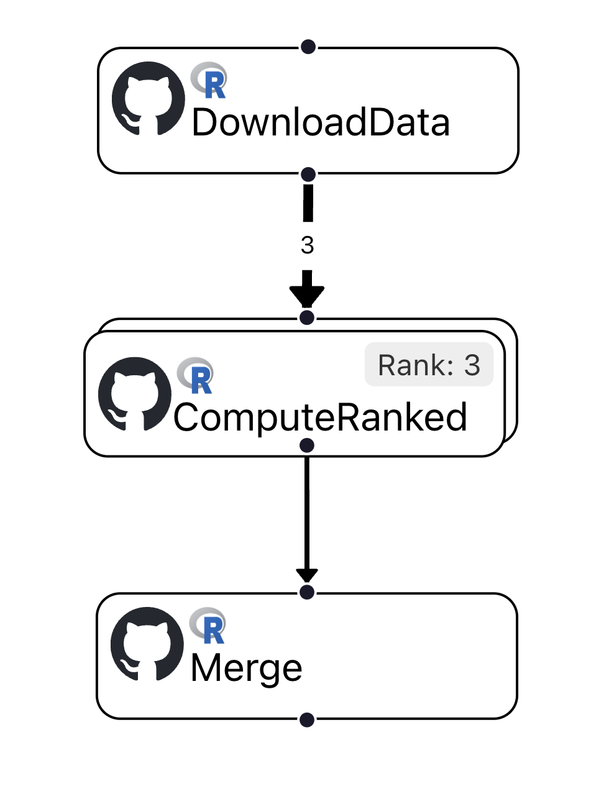

# Concurrent Actions

FaaSr supports the invocation of multiple concurrent actions in the workflow. This is useful in workflows where the workflow developer is able to determine that multiple functions can safely execute in parallel - for example, when different functions operate on independent files/datasets There are two approaches possible to invoke actions to execute concurrently:

- Multiple distinct actions explicitly invoked with edges from the same predecessor in the workflow DAG, or
- A single action that is invoked _N times_, where _N_ is a configurable integer number, greater than 1; each invocation of the action is assigned a unique _rank_ (an integer from _1_ to _N_) that is available to the user function via the `faasr_rank` API

## Multiple distinct actions

Consider the example below, where the action `DownloadData` invokes three concurrent actions that are distinct and explicitly added to the workflow graph: `ComputeA`, `ComputeB`, and `ComputeC`:

Each one of these actions can invoke a different user function concurrently. At the end, the action `Merge` executes the last user function, only after the three distinct actions `ComputeA`, `ComputeB`, and `ComputeC` have completed.

## Ranked actions

Ranked actions allows you to express concurrency with _multiple, parameterized invocations of the same user function_. Consider the workflow below, where the action `DownloadData` now invokes the _same_ action `ComputeRanked` three times, concurrently:

Each concurrent `ComputeRanked` action invokes the _same user function_. Similarly to the previous example, at the end, the action `Merge` executes the last user function, only after all three `ComputeRanked` actions have completed.

Inside the user function invoked by each `ComputeRanked` action, the `faasr_rank` API can be invoked to return a unique number (1, 2, or 3 in this example) that can be used to differentiate between invocations. As described in the [Python API] and [R API] documentation, `faasr_rank` allows the user function to determine the `maximum` rank (3 in this example) in addition to the `per-action` rank (1, 2, or 3). 

This information can be used, for example, to select different file names, folders, or data subsets that each action operates on. It is the responsibility of the programmer to properly use the rank information to partition datasets for safe concurrent execution, depending on their workflow and application logic.

[Python API]: py_api.md
[R API]: r_api.md

